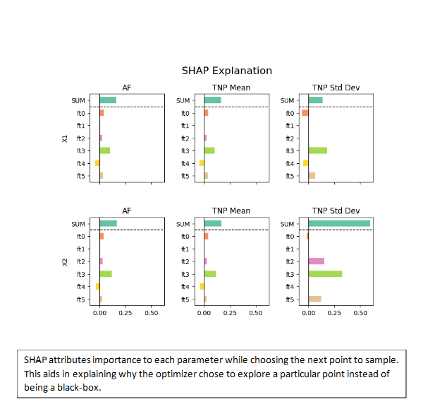

.. fusion-opt documentation master file, created by
   sphinx-quickstart on Mon Jun  3 11:44:00 2024.
   You can adapt this file completely to your liking, but it should at least
   contain the root `toctree` directive.

Welcome to fusion-opt's documentation!
======================================

Fusion-opt is a framework for applying Meta-learning based bayesian optimization equipped with humnan feedback capability during optimization, to guide the optimization specially in the initial stages
and also to have a warm start.

Main contributions of fusion-opt:

- Using state of the art Neural Acquistion process(NAP) as a surrogate for  black box functions
- Using preference model trained on experts' feedback to enable scoring preference of the points to query next 
- Suggesting multiple candidate points to human(expert), from which one to be selected as next point to be queried 
- A newly designed Acquistion Function combines the preference model and the NAP to suggest one candidate point
- The other candidate points are chosen by desired well-known statistical or Monte-carlo based Acquistion functions such as EI, MES, ...
- Modular design, i.e users can utilize pre-defined modules for preference models, or build their own
- Explainability, the framework explains each of the candidate points so that human in the loop can make better decsion for selecting the next point

.. toctree::
   :maxdepth: 2
   :caption: Contents:

Indices and tables
==================

* :ref:`genindex`
* :ref:`modindex`
* :ref:`search`
